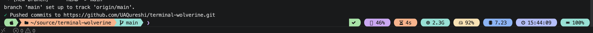
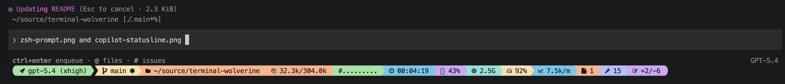
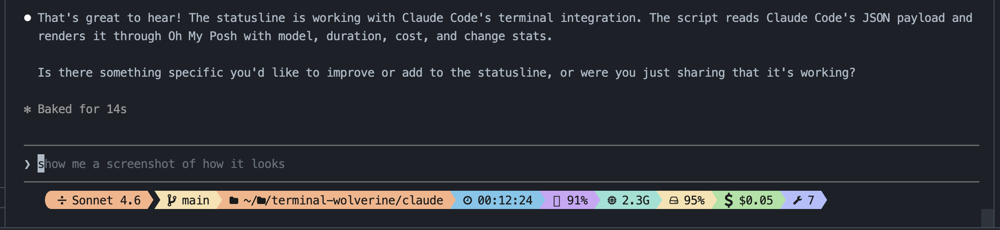

# terminal-wolverine

A Catppuccin-styled, pill-shaped terminal setup for **macOS** that gives you:

- A fast, single-line **Oh My Posh** prompt for interactive `zsh` with system pills (CPU, RAM, disk, load, time, battery) on the right.
- A matching **GitHub Copilot CLI statusline** with the same aesthetic plus session-aware metrics: model, context gauge, duration, **cost ($)**, **tokens/min**, **files edited**, **tool-call count**, and `+/- lines`.
- A matching **Claude Code statusline** with the same pills (model, duration, CPU/RAM/disk, **cost**, **files edited**, **tool calls**, `+/-`).

Built around three constraints discovered the hard way:

1. Oh My Posh v3's `command` segment was removed → we use a `precmd` hook that exports env vars consumed by `text` segments.
2. The `sysinfo` segment crashes with SIGSEGV on macOS → we read RAM/CPU/disk via tiny shell helpers.
3. Copilot CLI's statusline is a one-shot stdin → stdout pipe → we keep per-session state in `${TMPDIR}/copilot_session_<id>.json`.

---

## What's in this repo

```
terminal-wolverine/
├── README.md
├── install.sh                       # idempotent installer with backups
├── copilot/
│   ├── statusline.sh                # entry point Copilot CLI invokes
│   └── statusline.omp.json          # OMP theme for the statusline
├── claude/
│   ├── statusline.sh                # entry point Claude Code invokes
│   └── statusline.omp.json          # OMP theme for the Claude statusline
├── oh-my-posh/
│   ├── zsh.omp.json                 # interactive zsh prompt theme
│   ├── mem.sh                       # free RAM (vm_stat → GiB)
│   ├── load.sh                      # 1-min load average (uptime)
│   ├── disk.sh                      # used % on macOS Data volume
│   └── cpu.sh                       # CPU % (top, ps fallback)
└── zsh/
    └── zshrc-omp-snippet.sh         # the block to paste into ~/.zshrc
```

---

## Final result

**Interactive zsh prompt** (single line, cursor right after `❯`):



**Copilot CLI statusline** (one wide pill bar):



**Claude Code statusline** (same aesthetic, Claude-specific metrics):



| pill | meaning |
| --- | --- |
|  | model name (from Copilot payload) |
|  | working directory |
|  ctx | tokens used / context window |
| `##........` | gauge of context % used |
|  | wall-clock duration of this Copilot session |
|  | CPU % across all cores |
|  | free RAM |
|  | disk used % (real user volume) |
|  $ | cumulative session cost (when Copilot exposes it) |
|  /m | tokens-per-minute, peak ÷ elapsed |
|  | files edited this session |
|  | tool-call count this session |
|  +/- | lines added / removed |

---

## Prerequisites

- macOS (Apple Silicon or Intel).
- `zsh` (default on macOS).
- `python3` (preinstalled on macOS).
- A Nerd Font in your terminal (e.g. *MesloLGS NF*, *FiraCode Nerd Font*) — needed for the pill icons.
- **Oh My Posh** installed somewhere on `PATH`.

### Install Oh My Posh

Homebrew often fails on Intel macOS with `/usr/local/Cellar is not writable`. The official installer to a user-local dir works everywhere:

```bash
curl -fsSL https://ohmyposh.dev/install.sh | bash -s -- -d "$HOME/.local/bin"
```

Make sure `~/.local/bin` is on your `PATH` (the installer prints the export line if not).

---

## Install

```bash
git clone <this repo> ~/source/terminal-wolverine
cd ~/source/terminal-wolverine
./install.sh
```

The installer copies files into:

- `~/.config/oh-my-posh/` — theme + helper scripts
- `~/.copilot/` — Copilot CLI statusline + theme

Existing files are backed up with a `.bak.<timestamp>` suffix.

After it finishes:

1. **Append the zsh snippet** to `~/.zshrc`:
   ```bash
   cat ~/source/terminal-wolverine/zsh/zshrc-omp-snippet.sh >> ~/.zshrc
   ```
2. **Enable the Copilot statusline** (see next section).
3. Reload zsh:
   ```bash
   exec zsh
   ```

---

## Copilot CLI settings

GitHub Copilot CLI reads `~/.copilot/settings.json`. Add (or merge) these keys:

```json
{
  "statusLine": {
    "type": "command",
    "command": "/Users/<you>/.copilot/statusline.sh",
    "padding": 1
  },
  "feature_flags": {
    "enabled": ["STATUS_LINE"]
  },
  "experimental": true
}
```

> Replace `<you>` with your actual username (the path must be absolute).

If the file already exists, only add the missing keys; leave anything else untouched. Restart Copilot CLI for the statusline to appear.

---

## Claude Code settings

Claude Code reads `~/.claude/settings.json`. The installer registers it for you, but if you prefer to do it manually:

```json
{
  "statusLine": {
    "type": "command",
    "command": "/Users/<you>/.claude/statusline.sh",
    "padding": 1
  }
}
```

Restart Claude Code (`/exit`, then re-open) to pick up the change.

What works vs Copilot:

| pill | Copilot | Claude |
| --- | --- | --- |
| model, cwd, duration, CPU/RAM/disk, cost ($), files, tools, +/- | ✅ | ✅ |
| context tokens + gauge | ✅ | ❌ (not in payload) |
| tokens/min | ✅ | ❌ (no token field) |

Per-session state lives in `${TMPDIR}/claude_session_<session_id>.json`.

---

## How it works

### 1. The `precmd` hook (zsh)

`zsh/zshrc-omp-snippet.sh` adds a hook that runs before each prompt. It writes RAM / CPU / disk / load to a small cache file, **in the background**, then sources the file so the values are available as env vars (`OMP_RAM`, `OMP_CPU`, `OMP_DISK`, `OMP_LOAD`).

Refresh interval: **2 seconds**. The first prompt may show stale or empty values until the first background fetch lands; every subsequent prompt is essentially free.

Cache location: `${TMPDIR}/omp_sysinfo_$UID`.

### 2. Why `text` segments instead of `command` / `sysinfo`

| segment | status in OMP v3 on macOS | our workaround |
| --- | --- | --- |
| `command` | removed from the codebase | env vars + `text` segment |
| `sysinfo` | SIGSEGV reading Memory at `terminal_unix.go:201` | shell helpers + env vars |

So every dynamic value is a `text` segment with template `{{ if .Env.OMP_X }}…{{ end }}`.

### 3. Copilot statusline pipeline

Copilot CLI sends a JSON payload on stdin every time it renders the statusline. `copilot/statusline.sh` does this:

1. Slurps stdin.
2. Runs an embedded Python3 script that parses the payload and computes session metrics, persisting them to `${TMPDIR}/copilot_session_<session_id>.json`.
3. Exports each computed value as `COPILOT_STATUS_*` env vars.
4. Also reads the same `${TMPDIR}/omp_sysinfo_*` cache that the interactive prompt uses, so CPU/RAM/disk pills appear without re-running `vm_stat` or `top`.
5. Calls `oh-my-posh print primary --shell uni` against `~/.copilot/statusline.omp.json` to render the actual ANSI bar.

> `--shell uni` matters: it disables the zsh `%{...%}` wrappers that would otherwise be printed literally by Copilot.

### 4. Session metrics derivation

| metric | source if Copilot provides it | fallback |
| --- | --- | --- |
| **cost ($)** | `cost.total_cost_usd` / `cost.total_cost` / `total_cost_usd` | last known value carried in the state file |
| **tokens/min** | `peak(current_context_tokens) ÷ elapsed_minutes` | always computed, no fallback needed |
| **files edited** | `files_edited` / `edited_files` list | heuristic: increment when `+/-` line totals grow |
| **tool calls** | `tool_calls` / `tools_used` count | heuristic: +1 per statusline invocation |

If the heuristic is wrong for your version of Copilot CLI, capture a real payload by adding this temporary line near the top of `statusline.sh`:

```bash
echo "$PAYLOAD" >> /tmp/copilot_payload.log
```

Then run a real session, inspect `/tmp/copilot_payload.log`, and update the field names in the embedded Python.

---

## Customization recipes

### Add or remove a pill on the right side of zsh

Edit `oh-my-posh/zsh.omp.json`. The right side is a `rprompt` block — its segments render in order. Each pill has the same shape:

```json
{
  "type": "text",
  "style": "diamond",
  "leading_diamond": " \ue0b6",
  "trailing_diamond": "\ue0b4",
  "foreground": "#1a1a1a",
  "background": "#94e2d5",
  "template": "{{ if .Env.OMP_RAM }} \uf85a {{ .Env.OMP_RAM }} {{ end }}"
}
```

- `leading_diamond` / `trailing_diamond` (`\ue0b6` / `\ue0b4`) make the pill round.
- `foreground` / `background` are hex colours.
- `template` uses Go templates; `{{ if … }}…{{ end }}` hides the pill when the env var is empty.

To wire a new value:

1. Add a helper script in `oh-my-posh/` that prints a single line.
2. Add it to the `_omp_sysinfo` function in `zsh/zshrc-omp-snippet.sh` as another `export OMP_FOO=…`.
3. Add the matching `text` segment in `zsh.omp.json` (and optionally in `copilot/statusline.omp.json`).

### Change colours

The whole theme uses a Catppuccin-ish palette. Search-and-replace these hexes to retheme everything:

| hex | role |
| --- | --- |
| `#a6e3a1` | green (success / OS / battery full) |
| `#fab387` | peach (path / exec time) |
| `#f9e2af` | yellow (git clean / disk) |
| `#74c7ec` | cyan (python / duration) |
| `#89b4fa` | blue (load) |
| `#b4befe` | lavender (time / tools) |
| `#94e2d5` | teal (git up-to-date / RAM) |
| `#cba6f7` | mauve (cursor `❯` / changes / CPU) |
| `#f38ba8` | red (errors / low battery) |
| `#1a1a1a` | dark fg used on every pill |

### Change the cursor symbol

Look for `\u276f` (`❯`) in `zsh.omp.json` — last segment of the left block, plus the `transient_prompt`. Replace with anything you like (`$`, `λ`, `\uf138`, …).

### Render the prompt without re-launching zsh (debugging)

```bash
# Left + cursor:
~/.local/bin/oh-my-posh print primary \
  --config ~/.config/oh-my-posh/zsh.omp.json \
  --shell uni --pwd "$HOME"

# Right rail with sample env vars:
OMP_CPU="14%" OMP_RAM="2.0G" OMP_DISK="29%" OMP_LOAD="8.31" \
~/.local/bin/oh-my-posh print right \
  --config ~/.config/oh-my-posh/zsh.omp.json \
  --shell uni --pwd "$HOME"

# Copilot statusline with a fake payload:
PAYLOAD='{"session_id":"demo","model":{"display_name":"Claude Opus 4.7"},"context_window":{"current_context_tokens":16000,"displayed_context_limit":200000,"current_context_used_percentage":8},"cost":{"total_duration_ms":540000,"total_lines_added":15,"total_lines_removed":3,"total_cost_usd":0.34},"cwd":"'"$HOME"'"}'
printf '%s' "$PAYLOAD" | ~/.copilot/statusline.sh
```

---

## Troubleshooting

| symptom | likely cause | fix |
| --- | --- | --- |
| Cursor sits on a new line below the prompt | the right rail is a `prompt` block with `alignment: right` | change its `type` to `rprompt` |
| Statusline prints `%{` / `%}` characters | OMP rendered for zsh but Copilot displays raw | use `--shell uni` (already set) |
| Model shows as `{'id': None, 'display_name': None}` | model field is a dict | fixed in `statusline.sh` (handles dict) |
| `command not found: oh-my-posh` after install | `~/.local/bin` not on PATH | add `export PATH="$HOME/.local/bin:$PATH"` early in `~/.zshrc` |
| Pills missing on first prompt after `exec zsh` | background sysinfo fetch hasn't finished | wait one second, or seed cache by running helpers once before sourcing |
| Disk pill shows ~30 % when Settings says ~95 % | `df /` reads the read-only system volume on macOS | ensure `disk.sh` reads `/System/Volumes/Data` |
| `top` blocked or empty (e.g. inside a sandbox) | sandbox restriction | `cpu.sh` already falls back to `ps` |
| Copilot statusline shows but pills are blank | Copilot didn't expose those JSON fields | log a real payload (see *Session metrics derivation*) |
| Right side wraps to a second line | terminal too narrow vs left + right | shrink `path` `max_depth`, drop a pill, or widen the window |

---

## Uninstall

```bash
# Restore the most recent backup of each file
for f in ~/.config/oh-my-posh/zsh.omp.json \
         ~/.copilot/statusline.sh \
         ~/.copilot/statusline.omp.json; do
  ls -t "$f".bak.* 2>/dev/null | head -1 | xargs -I{} cp {} "$f"
done

# Remove the snippet from ~/.zshrc manually (look for "# ---- Oh My Posh prompt ----")
```

---

## Credits

- [Oh My Posh](https://ohmyposh.dev) by Jan De Dobbeleer.
- [Powerlevel10k](https://github.com/romkatv/powerlevel10k) for the original aesthetic this setup ports to OMP.
- Catppuccin colour palette.
